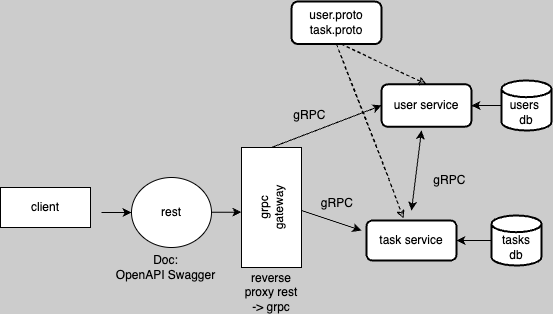

# go-task-application

A Task Management web application written in Golang microservices using the hexagonal architecture pattern.

This mono-repo holds all each microservice as an individual Go module. Each service holds a Dockerfile for containerization.

## Services 

`task-service` - [README](https://github.com/samverrall/go-task-application/blob/main/task-service/README.md)

## Service Pattern 

See the [Task Service](https://github.com/samverrall/go-task-application/tree/main/task-service) for an example hexagonal (ports and adapters) microservice.

- `internal` 
	- `domain`
	- `repositories`
	- `rest`
	- `app`
- `pkg`
	- `utils`
	- `config`
	- `logger`
- `Dockerfile`

